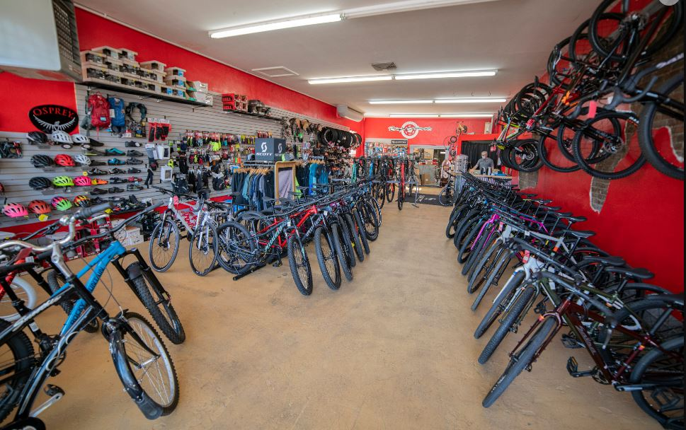
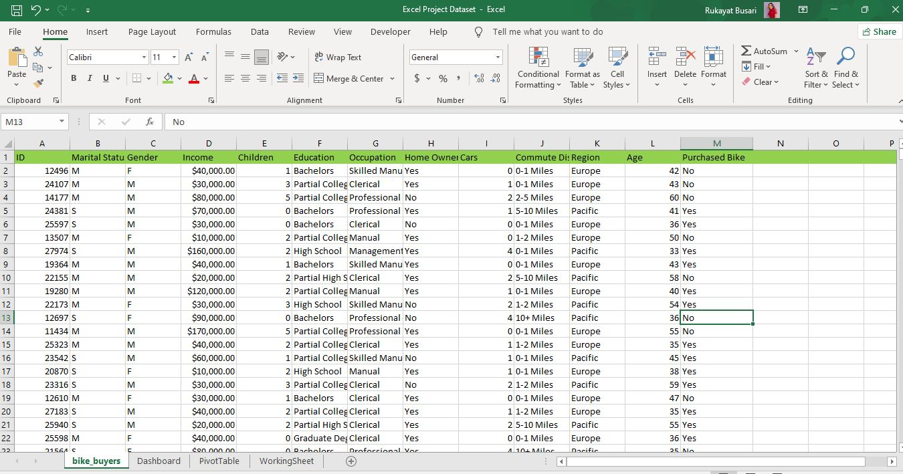
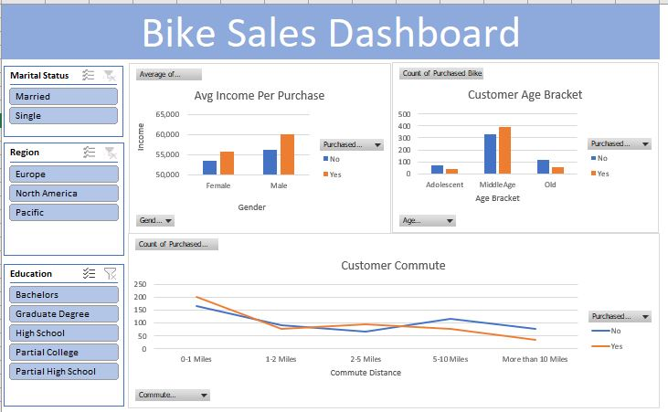

# Excel-project

# Correct Store : Excel Project

This is an Excel Project on sales analysis of an imaginary store called  **Correct Store**.  The purpose is to analyze and derive insight to ensue crucial questions are answer and help the company make data driven decision.

**Disclaimer** : All datasets and report do not represent any company, institution or country but a dummy dataset to demonstrate compatibility of Excel_

## Problem Statements

1.	What gender generate the highest income.

2.	What age bracket of customer has the highest impact on income.

3.	Which customer commute makes the highest purchase.

## Data Sourcing

The dataset was obtained on Kaggle, downloaded the excel file and extracted for cleaning and visualization.

## Skill and concept demonstrated.

Some of the Excel features applied include.

•	DAX (IF)
•	quickmeasure
•	navigation
•	PivotTable
•	Find and replace

##  Visualization and analysis

                 

1.	From the dashboard, it was observe that male gender generate $60,124 income while female gender generate $55,774 income

2.	The middle age customer makes the highest bike purchase of 388 bikes, follow by Old customers with a total purchase of 54 bikes while Adolescence customer purchases 39 bikes.

3.	Customers between 0-1 mile purchase a total of 200 bikes, customers between 1-2 mile purchase a total of 77 bikes, customers between 2-5 mile purchase a total of 95 bikes, customers between 5-10 mile purchase a total of 200 bikes, and customers with more than 10 mile purchase a total of 33 bikes.

## Conclusion and Recommendation

1.	Male gender generate the highest income of $60,124.

2.	The middle age customer makes the highest bike purchase of 388 bikes

3.	Customers between 0-1 mile purchase a total of 200 bikes

